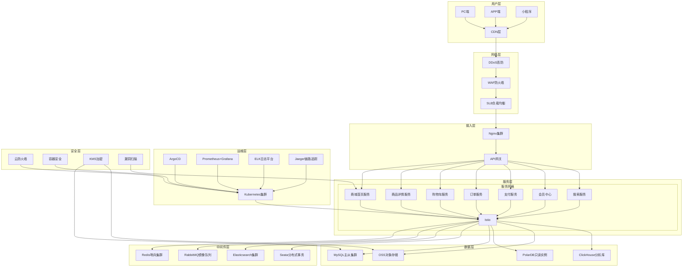

# 《云原生电商系统全链路DevOps实战》生产级架构设计

## 🎯 设计目标
严格按照一线互联网公司生产标准设计，满足以下核心要求：
- **高可用性**：99.99%服务可用性，RPO=0，RTO<30s
- **高性能**：核心链路响应时间<200ms，支持10万+QPS
- **安全性**：等保2.0三级合规，纵深防御体系
- **可扩展性**：支持水平扩展，应对业务快速增长
- **可观测性**：全链路监控、日志、追踪一体化

## 🏗️ 生产级架构总览



## 📦 基础设施规格 (阿里云)

### 1. Kubernetes集群 (生产级高可用)
| 节点类型 | 数量 | 实例规格 | 配置 | 用途 |
|---------|------|----------|------|------|
| Master | 3 | ecs.g7.2xlarge | 8核16G 100G云盘 | 集群控制平面 |
| Worker | 6 | ecs.g7.4xlarge | 16核32G 200G云盘 | 业务服务部署 |
| Etcd | 3 | ecs.g7.large | 4核8G 200G云盘 | 分布式存储 |

### 2. 数据库层
| 服务类型 | 实例规格 | 配置 | 用途 |
|---------|----------|------|------|
| MySQL主库 | rds.g7.2xlarge | 8核32G 1000G云盘 | 核心交易数据 |
| MySQL从库 | rds.g7.2xlarge | 8核32G 500G云盘 | 读请求分流 |
| PolarDB只读 | polardb.mysql.x8.large | 8核32G | 数据分析 |
| ClickHouse | clickhouse.g7.4xlarge | 16核64G 2000G云盘 | 日志和指标存储 |

### 3. 中间件层
| 服务类型 | 实例规格 | 配置 | 用途 |
|---------|----------|------|------|
| Redis哨兵 | ecs.g7.2xlarge ×3 | 8核16G 200G云盘 | 缓存服务 |
| RabbitMQ | ecs.g7.2xlarge ×3 | 8核16G 200G云盘 | 消息队列 |
| Elasticsearch | elasticsearch.g7.4xlarge ×3 | 16核64G 1000G云盘 | 搜索和日志 |

### 4. 网络层
| 服务类型 | 实例规格 | 配置 | 用途 |
|---------|----------|------|------|
| SLB负载均衡 | slb.s3.small ×2 | 双可用区 | 流量分发 |
| WAF防火墙 | waf.s1.small | 高级版 | Web应用防护 |
| DDoS高防 | ddos高防IP | 300G防护 | 大流量攻击防护 |

## 🔧 核心技术栈

### 容器与编排
- **Kubernetes 1.28**：生产级容器编排
- **Istio 1.19**：服务网格，流量治理
- **ArgoCD 2.8**：GitOps持续部署
- **Calico 3.26**：CNI网络插件
- **Rook 1.12**：CSI存储编排

### CI/CD自动化
- **Jenkins 2.426**：持续集成流水线
- **SonarQube 10.2**：代码质量扫描
- **Trivy 0.48**：镜像安全检测
- **Argo Rollouts 1.6**：灰度发布

### 可观测性
- **Prometheus 2.47**：监控指标采集
- **Grafana 10.1**：可视化仪表盘
- **Alertmanager 0.26**：告警管理
- **ELK 8.11**：日志分析平台
- **Jaeger 1.49**：分布式链路追踪

### 安全合规
- **阿里云WAF**：Web应用防火墙
- **云防火墙**：网络层防护
- **容器安全服务**：镜像漏洞扫描
- **KMS**：数据加密服务
- **OPA 0.57**：策略授权控制

## 📊 生产级指标承诺

| 指标项 | 目标值 | 验收标准 |
|-------|--------|----------|
| 服务可用性 | 99.99% | 年度 downtime <52.56分钟 |
| 核心链路响应时间 | <200ms | P95延迟 <200ms |
| 数据库读写性能 | 提升3倍 | 读请求90%分流到从库 |
| 缓存命中率 | 99%+ | 热点数据缓存命中率 |
| 资源利用率 | 70%+ | K8s集群资源利用率 |
| 故障恢复时间 | <5分钟 | 自动故障转移和恢复 |
| 安全合规 | 等保2.0三级 | 通过第三方合规认证 |

## 🛡️ 安全架构设计

### 1. 纵深防御体系
```
用户访问 → DDoS高防 → WAF → 云防火墙 → 容器安全 → 应用层安全 → 数据加密
```

### 2. 数据安全
- **传输加密**：全站HTTPS，TLS 1.3
- **存储加密**：云盘加密、数据库加密、对象存储加密
- **敏感数据**：个人信息、支付数据加密存储

### 3. 权限管控
- **RBAC权限**：细粒度角色权限控制
- **OPA策略**：统一授权管理
- **审计日志**：全链路操作审计，保存180天

## 📈 性能优化方案

### 1. 多级缓存架构
```
浏览器缓存 → CDN缓存 → 应用缓存 → Redis缓存 → 数据库
```

### 2. 数据库优化
- **分库分表**：订单、商品数据按业务维度拆分
- **读写分离**：90%读请求分流到从库
- **索引优化**：定期分析慢查询，优化索引

### 3. 容器优化
- **资源QoS**：Guaranteed/Burstable/BestEffort分层调度
- **Sidecar瘦身**：优化Istio代理资源占用
- **节点亲和性**：核心服务调度到高性能节点

## 🚨 容灾与恢复

### 1. 多可用区部署
- 所有核心服务跨AZ部署
- 数据库跨AZ同步
- 存储多副本冗余

### 2. 备份策略
- **全量备份**：每日凌晨2点，保留30天
- **增量备份**：每小时一次，保留7天
- **异地备份**：备份数据同步到其他区域

### 3. 故障演练
- 每月进行故障演练
- 包括节点故障、网络分区、数据损坏等场景
- 验证恢复流程和时间

## 💰 成本评估 (按5小时计算)
| 服务类型 | 规格 | 数量 | 按需单价 | 5小时费用 |
|---------|------|------|----------|----------|
| ECS实例 | g7.2xlarge | 9 | 4.2元/小时 | 189元 |
| RDS数据库 | rds.g7.2xlarge | 2 | 3.8元/小时 | 38元 |
| PolarDB | polardb.mysql.x8.large | 1 | 2.5元/小时 | 12.5元 |
| SLB负载均衡 | slb.s3.small | 2 | 0.15元/小时 | 1.5元 |
| WAF防火墙 | waf.s1.small | 1 | 0.3元/小时 | 1.5元 |
| DDoS高防 | 300G防护 | 1 | 8元/小时 | 40元 |
| **总计** | | | | **282.5元** |

> 注：实际使用可能因阿里云优惠政策有所不同，270元预算基本覆盖核心服务

## 📋 交付物清单

1. **架构设计文档**：本文件，包含完整架构设计
2. **基础设施代码**：Terraform/Kubernetes自动化部署代码
3. **CI/CD流水线**：Jenkinsfile+ArgoCD配置
4. **监控告警配置**：Prometheus规则+Grafana仪表盘
5. **安全配置脚本**：WAF/防火墙/加密配置
6. **操作手册**：部署、运维、故障排查指南
7. **性能测试报告**：压测数据和优化建议

---

**版本**：v1.0  
**日期**：2026-05-10  
**作者**：小白老师（资深运维工程师）